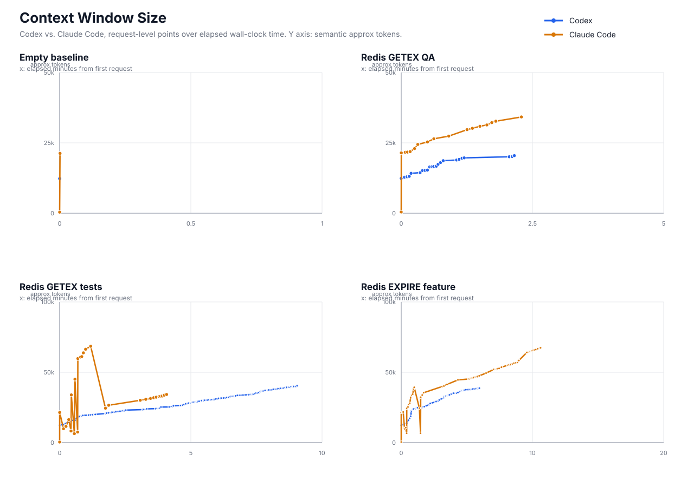
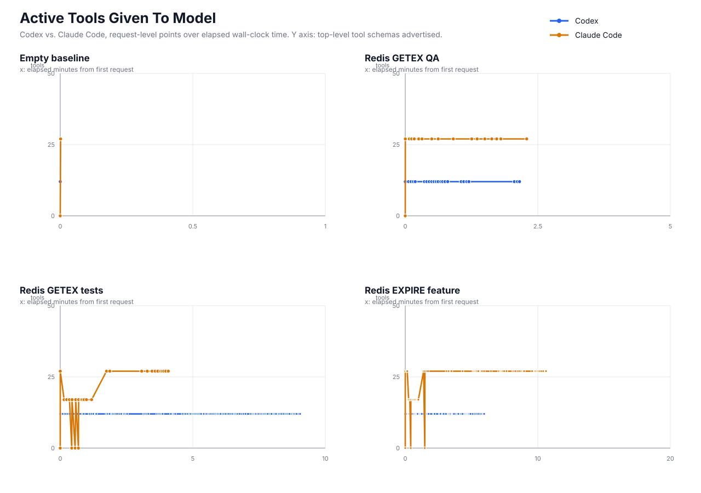
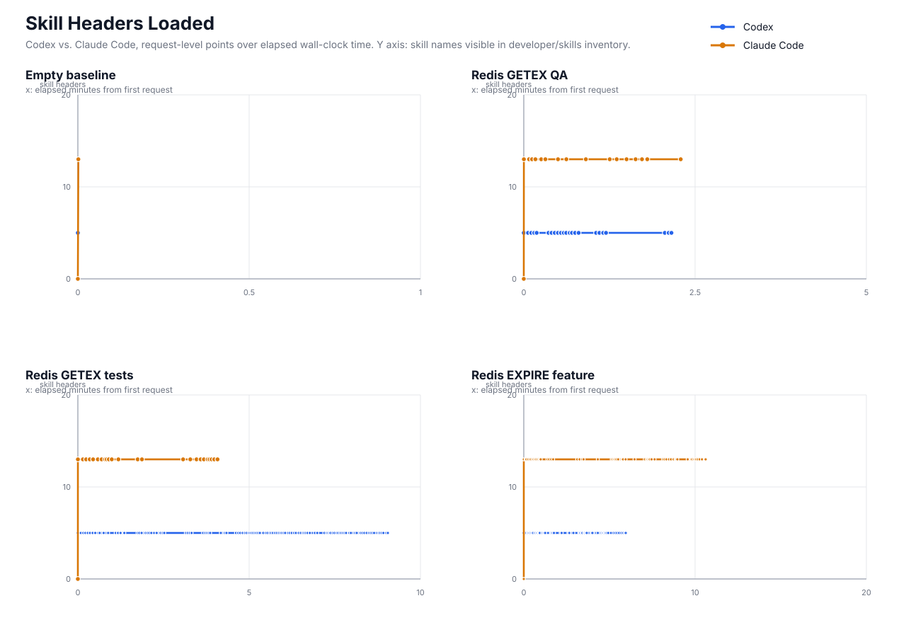
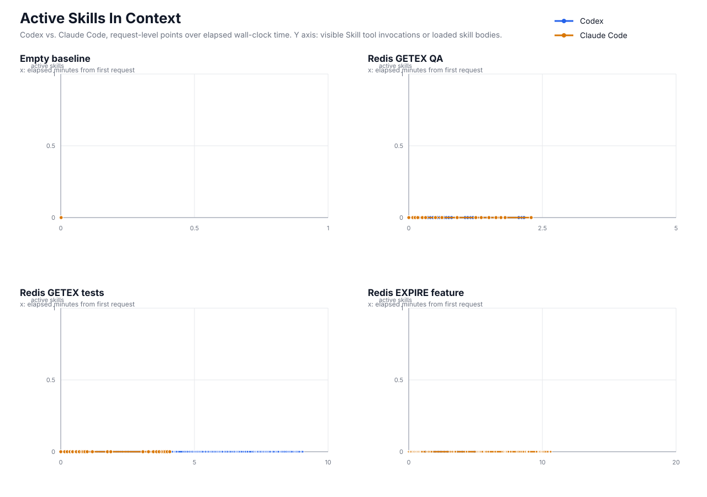

# Codex vs. Claude Code Context Growth Plots - 2026-06-04

This report plots the matched representative task runs at the level of model API requests. Each point is one request captured in `prompt_payloads.jsonl`; the x-axis is elapsed wall-clock time from the first captured request in that run. Provider `count_tokens` probe requests are excluded from the main plots because they are tokenizer checks, not generation/model-context turns.

## Definitions

- `context_tokens`: exact provider `input_tokens` from the Anthropic-compatible `count_tokens` endpoint when present. Codex requests are first replayed through Moonbridge to count the converted Anthropic/DeepSeek request. If an exact count is missing, the CSV marks the row as a semantic chars/4 fallback.
- `active_tools`: count of top-level tools advertised to the model on that request.
- `skill_headers_loaded`: count of skill names visible in the developer/skills inventory text.
- `active_skills`: count of visible `Skill` tool invocations in the request context.
- Exact coverage: 298/298 plotted generation requests have provider-counted input tokens.

## Plots

## Summary Table

| task | agent | requests | duration min | peak context toks | tool counts | skill header counts | active skill counts |
| --- | --- | ---: | ---: | ---: | --- | --- | --- |
| Empty baseline | Codex | 1 | 0.00 | 11,307 | [12] | [5] | [0] |
| Empty baseline | Claude Code | 2 | 0.00 | 20,651 | [0, 27] | [0, 13] | [0] |
| Redis GETEX QA | Codex | 23 | 2.16 | 21,469 | [12] | [5] | [0] |
| Redis GETEX QA | Claude Code | 17 | 2.29 | 37,265 | [0, 27] | [0, 13] | [0] |
| Redis GETEX tests | Codex | 112 | 9.05 | 48,238 | [12] | [5] | [0] |
| Redis GETEX tests | Claude Code | 25 | 4.08 | 77,879 | [0, 17, 27] | [0, 13] | [0] |
| Redis EXPIRE feature | Codex | 57 | 5.95 | 44,495 | [12] | [5] | [0] |
| Redis EXPIRE feature | Claude Code | 61 | 10.62 | 76,739 | [0, 17, 27] | [0, 13] | [0] |

## Why The Context Line Drops

The context window is measured per model request, not as a single global memory pool across every Claude Code worker. In these runs, the downward steps are Claude Code parent/subagent boundaries. The parent starts with the full 27-tool surface, delegates exploration to a reduced 17-tool Explore subagent whose own transcript grows, then receives a compact `Agent` tool result summary. The parent does not ingest the subagent's entire tool transcript.

Mechanically, each model API call is a fresh request body. The model does not automatically keep the previous request's full prompt unless the agent sends that content again. So a subagent can spend many tokens while it is active, then the next parent request can be smaller because Claude Code resends only the parent transcript plus the subagent's summarized `Agent` result. This is a context-window drop, not a refund or erasure of tokens already spent.

For billing and total work accounting, the subagent requests should still be counted. For active-context accounting, the drop is real because the parent request no longer contains the subagent's full working history. These are different measurements: active context window versus cumulative token consumption.

The active-tools plot shows the same boundary. Claude Code parent requests advertise the full 27-tool surface. The Explore subagent requests advertise a reduced 17-tool surface: `Bash`, `CronCreate`, `CronDelete`, `CronList`, `EnterWorktree`, `ExitWorktree`, `Glob`, `Grep`, `Read`, `Skill`, `TaskCreate`, `TaskGet`, `TaskList`, `TaskStop`, `TaskUpdate`, `WebFetch`, and `WebSearch`. The reduced surface removes parent-level orchestration and editing tools such as `Agent`, `Edit`, `Write`, `Workflow`, plan-mode tools, notebook editing, and user-question tooling. So the tool-count dips are not random schema churn; they mark the subagent execution scope.

| task | agent | request transition | from tokens | to tokens | drop | interpretation |
| --- | --- | ---: | ---: | ---: | ---: | --- |
| Redis GETEX tests | Claude Code | 2 -> 3 | 20,847 | 9,972 | 10,875 | Main-agent prompt handed work to a reduced 17-tool Explore subagent. |
| Redis GETEX tests | Claude Code | 16 -> 17 | 77,879 | 24,398 | 53,481 | Explore subagent returned; parent retained the Agent result summary, not the full subagent transcript. |
| Redis EXPIRE feature | Claude Code | 4 -> 5 | 21,311 | 9,978 | 11,333 | Main-agent prompt handed work to a reduced 17-tool Explore subagent. |
| Redis EXPIRE feature | Claude Code | 16 -> 17 | 46,019 | 24,710 | 21,309 | Explore subagent returned; parent retained the Agent result summary, not the full subagent transcript. |

## Interpretation Notes

- Claude Code has an initial title/metadata-style request with no tools before the main agent request. That request is included because it is a real captured model request; the main-agent context jump appears immediately after it.
- Codex advertises a stable 12-tool surface in these representative runs. Claude Code alternates between a 27-tool main-agent surface and a 17-tool reduced surface in the more complex runs.
- Skill headers are available-context, not actual skill activation. In these matched runs, the skill inventory is loaded, but actual skill activation remains zero.
- The CSV next to this report includes `semantic_approx_tokens`, layer-level approximate token columns, and `body_approx_tokens` so the exact total can be audited against the older semantic estimate and raw request-body size.

## Data

- Raw time series: `context_growth_timeseries.csv`
- Exact token backfill: `exact_context_tokens.jsonl`
