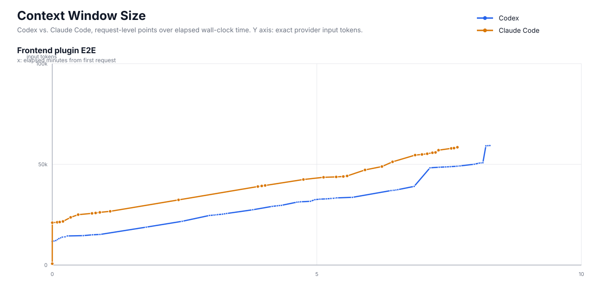
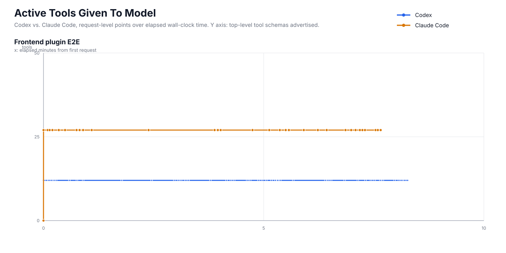
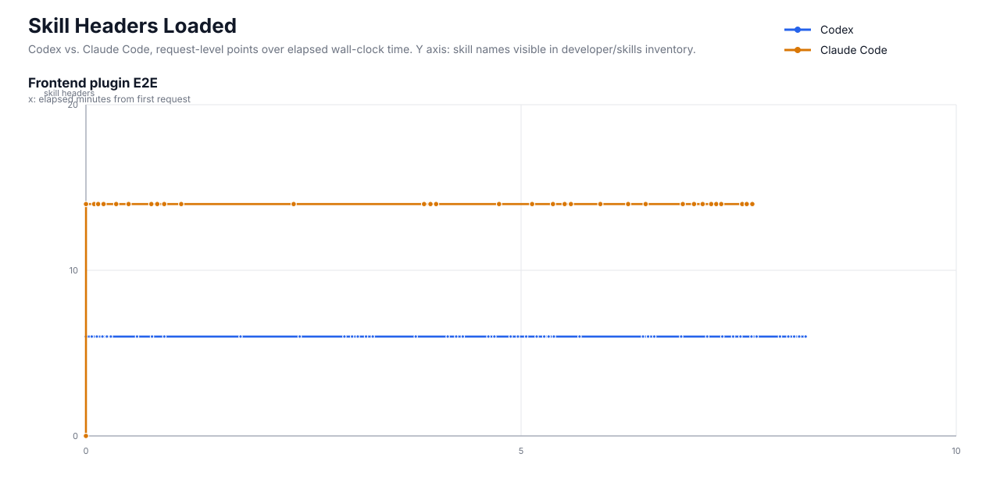
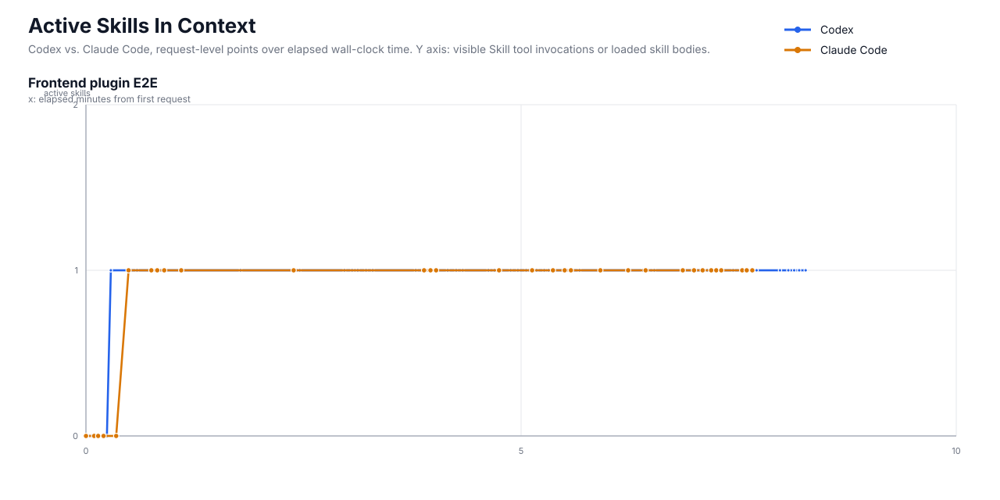

# Frontend Plugin E2E Context Growth Plots - 2026-06-05

This report plots the matched long-horizon frontend/plugin implementation runs at the level of model API requests. Each point is one request captured in `prompt_payloads.jsonl`; the x-axis is elapsed wall-clock time from the first captured request in that run. Provider `count_tokens` probe requests are excluded from the main plots because they are tokenizer checks, not generation/model-context turns.

## Definitions

- `context_tokens`: exact provider `input_tokens` from the Anthropic-compatible `count_tokens` endpoint when present. Codex requests are first replayed through Moonbridge to count the converted Anthropic/DeepSeek request. If an exact count is missing, the CSV marks the row as a semantic chars/4 fallback.
- `active_tools`: count of top-level tools advertised to the model on that request.
- `skill_headers_loaded`: count of skill names visible in the developer/skills inventory text.
- `active_skills`: count of visible `Skill` tool invocations or loaded skill bodies in the request context.
- Exact coverage: 77/77 plotted generation requests have provider-counted input tokens.

## Plots

## Summary Table

| task | agent | requests | duration min | peak context toks | tool counts | skill header counts | active skill counts |
| --- | --- | ---: | ---: | ---: | --- | --- | --- |
| Frontend plugin E2E | Codex | 45 | 8.27 | 59,339 | [12] | [6] | [0, 1] |
| Frontend plugin E2E | Claude Code | 32 | 7.66 | 58,489 | [0, 27] | [0, 14] | [0, 1] |

## Context And Skill Interpretation

For this long-horizon frontend/plugin run, neither agent used Claude-style Explore subagents. The context line therefore mostly shows ordinary parent-thread growth: task prompt, static instructions, tool schemas, file reads, edits, build/test output, and the loaded frontend-design skill body.

The active-tools plot is intentionally boring here: Codex advertises the same 12-tool surface on every request; Claude Code has one initial zero-tool title request and then advertises its 27-tool main-agent surface throughout. That makes this run useful as a control for skill activation without subagent tool-surface changes.

The active-skills plot is the key event marker. Skill headers are visible from the start as inventory, but the skill body only becomes active after the agent explicitly opens or invokes `frontend-design`. Codex reads the `SKILL.md` body through a file/tool path; Claude Code invokes the `Skill` tool and receives a synthetic user message containing the plugin skill body.

| task | agent | request transition | from tokens | to tokens | drop | interpretation |
| --- | --- | ---: | ---: | ---: | ---: | --- |
| none | none | - | - | - | - | No downward transitions in plotted generation requests. |

## Interpretation Notes

- Claude Code has an initial title/metadata-style request with no tools before the main agent request. That request is included because it is a real captured model request.
- Codex advertises a stable 12-tool surface in this run. Claude Code switches from the zero-tool title request to its 27-tool main-agent surface and stays there.
- Skill headers are available-context, not actual skill activation. `active_skills` marks visible Skill-tool invocation or loaded skill-body evidence in the request context.
- The CSV next to this report includes `semantic_approx_tokens`, layer-level approximate token columns, and `body_approx_tokens` so the exact total can be audited against the older semantic estimate and raw request-body size.

## Data

- Raw time series: `context_growth_timeseries.csv`
- Exact token backfill: `exact_context_tokens.jsonl`
